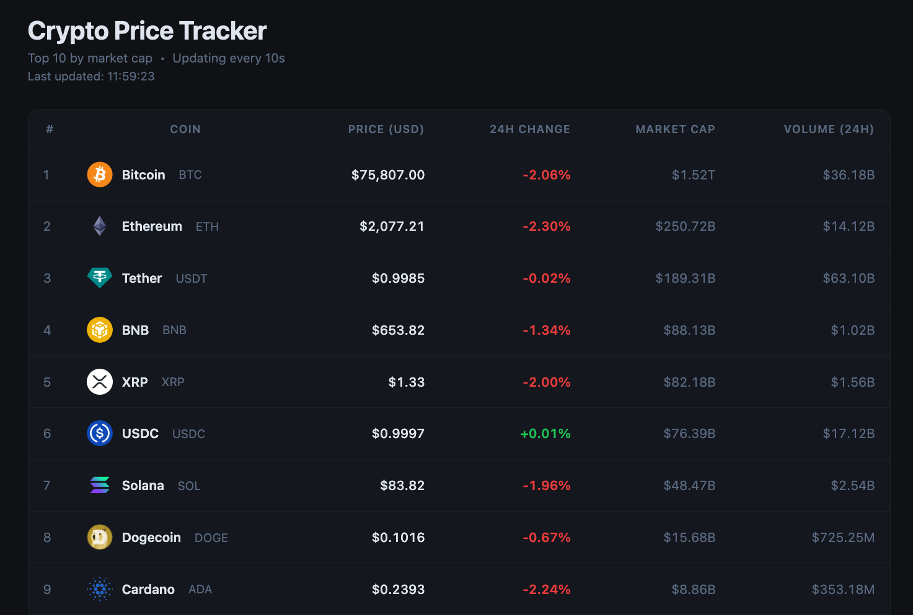

# Crypto Price Tracker

A simple, realtime cryptocurrency price tracker that runs in the browser. No frameworks, no build step, just HTML, CSS, and JavaScript.



## Features

- Tracks the **top 10 cryptocurrencies** by market cap (BTC, ETH, USDT, BNB, XRP, USDC, SOL, DOGE, ADA, AVAX)
- **Prices refresh automatically every 10 seconds** via the CoinGecko public API
- **Green/red flash animation** on rows when a price changes between polls
- 24h price change percentage with color coding (green = up, red = down)
- Market cap and 24h volume columns
- Live "Last updated" timestamp
- Error banner if the API is rate-limited or unreachable
- Responsive layout — works on mobile

## Running Locally

**Option A — Node.js** (no dependencies required):

```bash
node server.js
```

**Option B — Python** (if Node isn't installed):

```bash
python3 -m http.server 4000
```

Then open [http://localhost:4000](http://localhost:4000) in your browser.

You can also just double-click `index.html` to open it directly — though browsers may block the CoinGecko API fetch due to CORS when loaded as a `file://` URL, so the local server is recommended.

## Tech Stack

| Layer | Tool |
|---|---|
| Frontend | Vanilla HTML + CSS + JavaScript |
| Data | [CoinGecko API](https://www.coingecko.com/en/api) (free, no key required) |
| Server | Node.js built-in `http` module (zero npm dependencies) |

## Project Structure

```
├── index.html    # App shell and table layout
├── style.css     # Dark theme, flash animations, responsive styles
├── app.js        # Fetch loop, DOM updates, price-change detection
├── server.js     # Minimal static file server (Node.js, no npm needed)
└── package.json  # npm start script
```

## API

Prices are fetched from the [CoinGecko `/coins/markets`](https://docs.coingecko.com/reference/coins-markets) endpoint. No API key is needed. The free tier has a rate limit of ~30 calls/minute, which is well within the 10-second poll interval.
